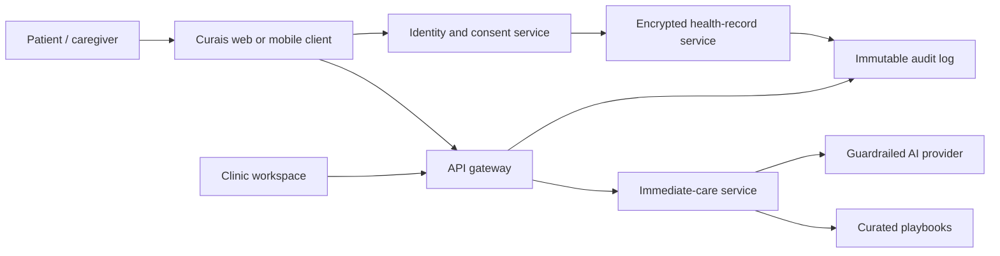

# Curais Technical Architecture Document

## Architecture direction

Keep the current Next.js application as the R1 presentation and immediate-guidance layer. Authenticated records remain in the Go data platform and are never copied into browser session storage. For a signed-in, explicitly opted-in search, the server may attach a minimized snapshot of allergies, current medicines, and up to five recent history entries to that single AI request; the snapshot is not persisted with the session result.

## R1 components

- `app/page.js`: symptom entry, quick options, safety CTA.
- `app/api/route.js`: server-side AI call, validation, and IP rate limit.
- `data/quickAid.js`: curated first-aid playbooks, preferred for recognized emergencies.
- `context/ResultsContext.js`: short-lived browser session guidance only.

## R2+ components

- Managed identity provider with OTP/phone verification, session rotation, and MFA for clinical users.
- Relational transactional store for accounts, consent, clinic membership, and records; encrypted object storage for attachments.
- API boundary that authenticates every request, authorizes per resource, validates schemas, applies rate limits, and emits audit events.
- Background jobs for notifications and exports; no health data in analytics or error-monitoring payloads.

## Data boundaries

| Class | Examples | Handling |
| --- | --- | --- |
| Public | static first-aid content | versioned, reviewed content repository |
| Sensitive | symptom text, health history, vitals | encrypted transit/storage, least privilege |
| Highly sensitive | identity + health record, clinical notes | separate access controls, audit every read/write/export |

## Key technical decisions

- Curated content wins for known high-risk scenarios; AI is a fallback with a strict schema and escalation policy.
- The model must receive the minimum symptom context; provider retention/training settings must be contractually reviewed before R2.
- Saved context is off by default, requires an explicit per-search choice, excludes identity/contact fields, is length/count limited, and must never reduce emergency escalation or produce diagnosis/prescribing advice.
- Store an immutable content/version identifier with saved guidance so it can be explained or withdrawn later.
- Design APIs around patient-controlled sharing grants rather than clinic-wide record visibility.
